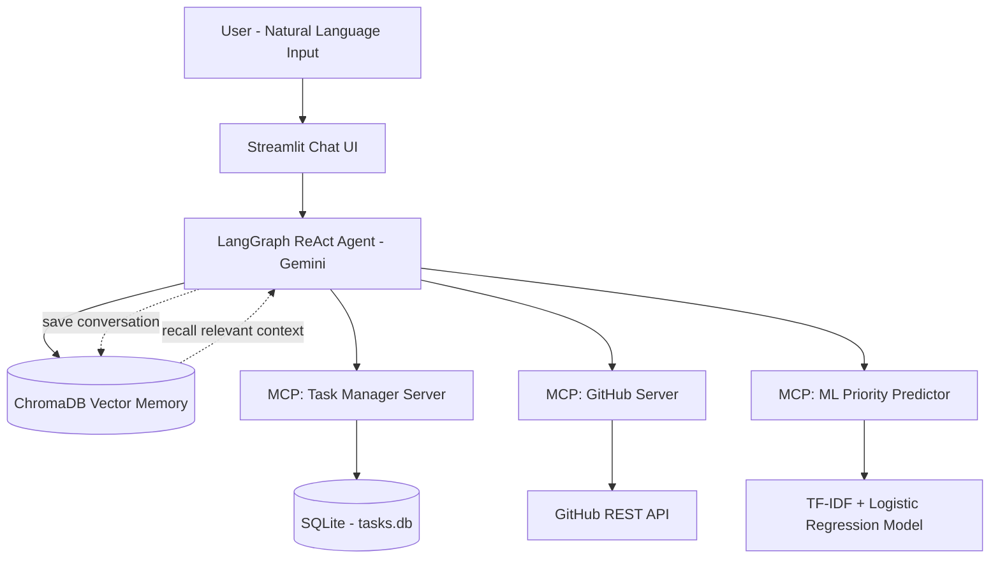

# 🤖 Personal Ops Agent — AI Agent with MCP Tools & Memory

An **agentic AI system** built on the **Model Context Protocol (MCP)** — connects a LangGraph-powered AI agent to real tools (task management, GitHub, and a custom-trained ML classifier), with persistent long-term memory across sessions.

Built using **Python, LangGraph, and the official MCP SDK**, Personal Ops Agent leverages the **Google Gemini API** (`gemini-3.6-flash`) to reason over natural-language requests, decide which tool to call, take real action across multiple connected systems, and remember past conversations using vector-based memory (ChromaDB).

---

## 🏗️ Architecture & System Flow



### 🌟 How It Works (Simple Breakdown)

1. **User Request**: You type a plain-English request in the Streamlit chat UI.
2. **Memory Recall**: The agent searches ChromaDB for relevant facts from past conversations and injects them as context.
3. **Reasoning (LangGraph ReAct Agent)**: Gemini decides whether it needs a tool, and if so, which one — Task Manager, GitHub, or the ML Priority Predictor.
4. **MCP Tool Call**: The agent calls the chosen MCP server over stdio, using the standardized MCP protocol — the same protocol Anthropic/Claude use to connect models to external tools.
5. **Tool Execution**: The relevant server executes the action — writes to SQLite, calls the GitHub REST API, or runs the trained ML model — and returns a structured result.
6. **Response Generation**: The agent turns the tool's result into a natural-language reply.
7. **Memory Save**: The exchange is saved back into ChromaDB for future recall, even across restarts.

---

## 💻 Technical Architecture Flow

1. **User Input Phase**: The user interacts with the Streamlit chat interface, typing natural-language requests.
2. **Agent Processing**:
   - The request passes through `chat_with_memory()`, which recalls relevant memory and builds the message context.
   - The LangGraph `create_react_agent` reasons over the request and decides on a tool call.
3. **MCP Tool Dispatch**:
   - `MultiServerMCPClient` launches and connects to all 3 MCP servers as subprocesses over stdio.
   - The chosen server's `@mcp.tool()`-decorated function executes the actual logic (DB write, GitHub API call, or ML prediction).
4. **Persistence & Response**: Results are returned to the agent, a natural-language reply is generated, and the full exchange is embedded and stored in ChromaDB for long-term memory.

---

## 📂 Repository Structure & Key Modules

```text
personal-ops-agent/
├── mcp_server/                    # MCP Server 1: Task Manager
│   ├── db.py                      # SQLite connection, schema, and CRUD functions
│   ├── tools.py                   # add_task, list_tasks, complete_task (MCP tool definitions)
│   └── server.py                  # Entrypoint - runs the MCP server over stdio
│
├── github_mcp/                    # MCP Server 2: GitHub Integration
│   ├── tools.py                   # list_issues, create_issue (via PyGithub)
│   └── server.py                  # Entrypoint
│
├── ml_priority/                   # MCP Server 3: Custom NLP Model
│   ├── dataset.py                 # Hand-labeled training data (90 examples, 3 classes)
│   ├── train_model.py             # TF-IDF vectorization + Logistic Regression training/eval
│   ├── tools.py                   # predict_priority (loads trained model, returns prediction)
│   └── server.py                  # Entrypoint
│
├── agent/                         # Agent Core
│   ├── mcp_client.py              # MultiServerMCPClient - connects all 3 MCP servers
│   ├── memory.py                  # ChromaDB vector store - save_memory / recall_memory
│   ├── agent_graph.py             # LangGraph ReAct agent + memory-aware chat wrapper
│   └── main.py                    # CLI chat entrypoint
│
├── app.py                         # Streamlit chat UI (styled, password-gated)
├── requirements.txt
└── .env                           # API keys (not committed)
```

---

## 🛠️ Key Technical Pipelines

### 1. MCP Tool Registration
Each MCP server exposes its capabilities using `FastMCP` and the `@mcp.tool()` decorator. FastMCP inspects each function's type hints and docstring at runtime to auto-generate a JSON schema — so the tool's interface and its implementation can never drift out of sync. This is what lets any MCP client (Claude Desktop, MCP Inspector, or this project's own agent) discover and call the tools without custom integration code.

### 2. Multi-Server Tool Orchestration
`agent/mcp_client.py` uses `MultiServerMCPClient` to launch all 3 MCP servers as subprocesses over stdio and merge their tools into a single list. The agent doesn't need to know which server owns which tool — LangChain's tool-calling interface handles routing automatically. Adding a new tool source (like the ML predictor in Phase 5) required zero changes to the agent's reasoning logic.

### 3. Memory-Augmented Reasoning (RAG for Conversations)
`agent/memory.py` embeds text using Gemini's embedding model and stores it in a local ChromaDB vector store. Before every response, `chat_with_memory()` performs a similarity search over past exchanges and injects the most relevant ones as system context — the same retrieval-augmented pattern used in document-based RAG chatbots, applied here to conversation history instead.

### 4. Custom NLP Classification Pipeline
`ml_priority/train_model.py` converts task titles into TF-IDF vectors, trains a Logistic Regression classifier with a stratified train/test split, and evaluates it with a full classification report and confusion matrix. The trained model and vectorizer are serialized with `joblib` and loaded once by the MCP server at startup — this tool runs a real trained model, not an LLM call.

---

## ⚡ MCP Tools Reference

### Task Manager (`mcp_server`)
| Tool | Description |
|---|---|
| `add_task(title, due_date)` | Adds a new task to SQLite storage |
| `list_tasks(status)` | Lists tasks filtered by `pending`, `done`, or `all` |
| `complete_task(task_id)` | Marks a task as completed |

### GitHub (`github_mcp`)
| Tool | Description |
|---|---|
| `list_issues(repo, state)` | Lists issues from a GitHub repository |
| `create_issue(repo, title, body)` | Creates a new issue on GitHub |

### ML Priority Predictor (`ml_priority`)
| Tool | Description |
|---|---|
| `predict_priority(task_title)` | Predicts High/Medium/Low priority using a custom-trained TF-IDF + Logistic Regression model, with confidence score |

---

## ⚙️ Getting Started & Local Setup

### Prerequisites
- **Python**: 3.10 or higher
- **Node.js**: required only if testing with MCP Inspector
- **Google Gemini API Key**: [Get one from Google AI Studio](https://aistudio.google.com/app/apikey)
- **GitHub Personal Access Token**: with `repo` scope, from GitHub → Settings → Developer settings

### Step 1: Clone and set up the environment

```bash
git clone https://github.com/Gaurinavale/personal-ops-agent.git
cd personal-ops-agent
python -m venv venv
venv\Scripts\activate
pip install -r requirements.txt
```

### Step 2: Configure environment variables

Create a `.env` file in the project root:

```env
GEMINI_API_KEY=your_gemini_api_key
GITHUB_TOKEN=your_github_personal_access_token
APP_PASSWORD=your_demo_password
```

### Step 3: Train the ML priority classifier

```bash
python -m ml_priority.train_model
```

### Step 4: Run the agent

**CLI chat:**

```bash
python -m agent.main
```

**Web UI:**

```bash
streamlit run app.py
```

---

## 💬 Example Interactions

```text
You: Add a task to prepare my resume by Friday
Agent: I've added the task "Prepare my resume" with a due date of Friday.

You: What priority should "urgent server crash needs fix now" be?
Agent: This task is predicted to be high priority (confidence: 85%).

You: Show me open issues on my repo
Agent: There are currently no open issues.

You: What do you know about my task preferences?
Agent: You usually prefer setting due dates on Fridays.
```

---

## 🌟 Core Features List

- **Agentic Reasoning**: LangGraph ReAct loop — the agent reasons, acts, observes, and self-corrects across multiple steps
- **MCP-Based Tool Architecture**: 3 independent, pluggable MCP servers — new tools can be added without touching agent logic
- **Long-Term Memory**: ChromaDB vector store recalls relevant past context, verified to persist across full process restarts
- **Real External Actions**: Creates actual GitHub issues via natural language — not simulated
- **Custom-Trained NLP Model**: TF-IDF + Logistic Regression classifier trained from a hand-labeled dataset, not an LLM wrapper
- **Multi-Tool Orchestration**: Agent selects the correct tool automatically based on user intent
- **Styled Chat Interface**: Password-gated Streamlit UI with custom dark theme

---

## 🗺️ Roadmap

- [x] MCP Task Manager server (SQLite-backed)
- [x] LangGraph ReAct agent with Gemini
- [x] Long-term memory via ChromaDB
- [x] GitHub integration (multi-tool orchestration)
- [x] Custom-trained NLP priority classifier
- [ ] Live deployment
- [ ] Additional MCP tools (calendar, email)

---

## 👩‍💻 Author

**Gauri Navale**
[GitHub](https://github.com/Gaurinavale)